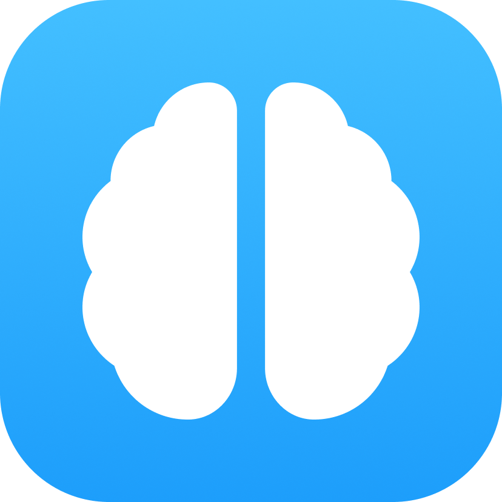
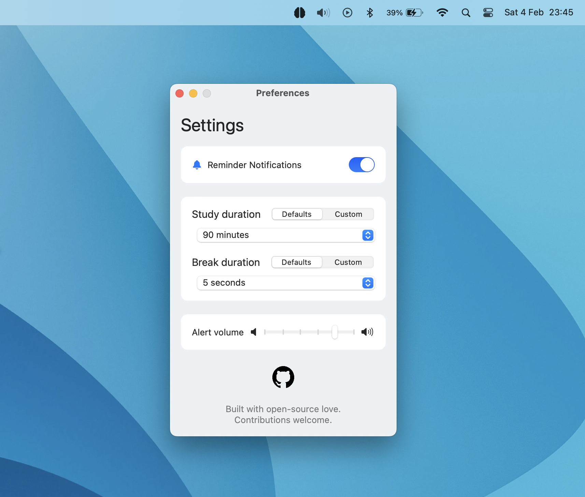
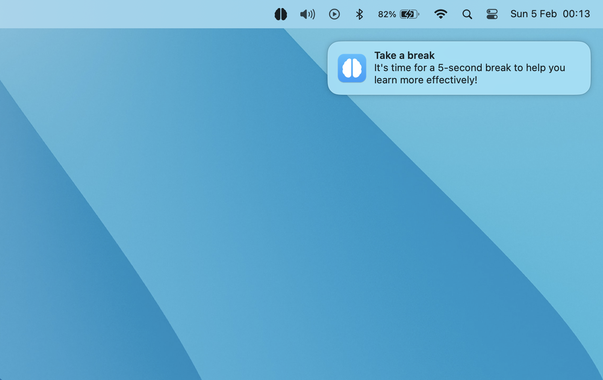

# MicroBreaks

This is a menubar app for macOS that helps you improve learning and memory through the use of breaks based on the "gap effect." Customize break frequency, duration, and activity, and receive reminder notifications to boost your study skills and memory retention. The app is implemented in SwiftUI. You can read more about the "Gap effect" [here](https://hubermanlab.com/teach-and-learn-better-with-a-neuroplasticity-super-protocol/)

 

